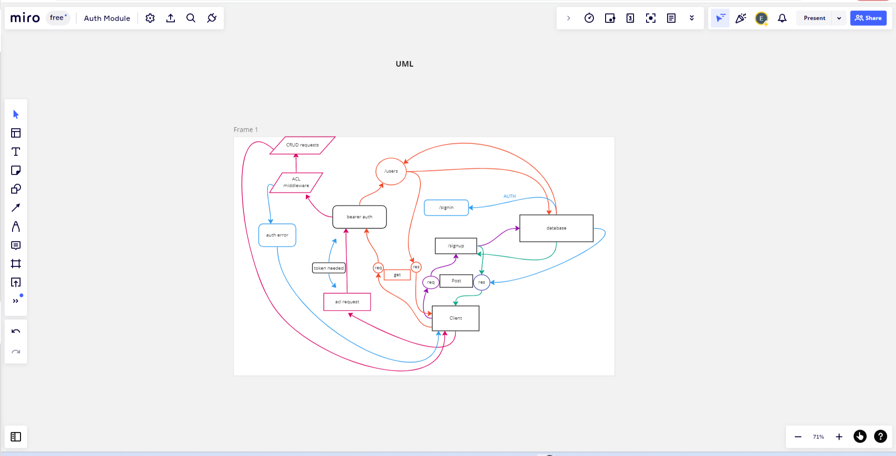

# LAB - Class 09

## Project: Auth-Module

### Author: Jonathan Staib, Eli Bailey

### Problem Domain

- Create a server that handles basic CRUD functionality with basic, bearer, and acl authorization.

### Links and Resources

- Github, render

### Setup

#### `.env` requirements (where applicable)

PORT
DATABASE_URL

#### How to initialize/run your application (where applicable)

- e.g. `npm start`

#### How to use your library (where applicable)

#### Features / Routes

- `/signin`
- `/signup`
- `/anime` with full CRUD functionality

#### Tests

- How do you run tests?
  npm test with jest and supertest
POST to /signup to create a new user.
POST to /signin to login as a user (use basic auth).
Need tests for auth middleware and the routes.
Does the middleware function.
Does the CRUD functionality work on anine route.

#### UML

